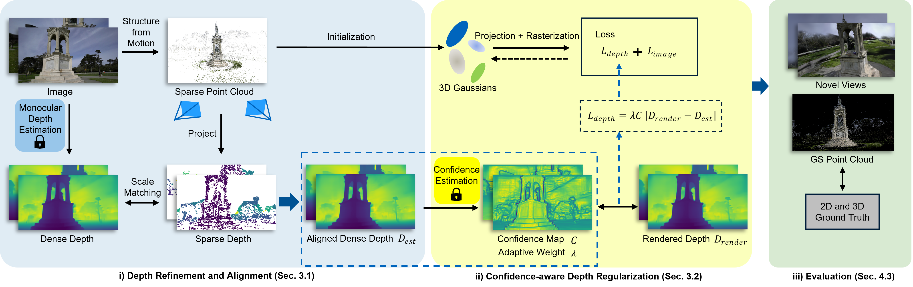

# CDGS: Confidence-Aware Depth Regularization for 3D Gaussian Splatting

#### [Qilin Zhang](https://www.linkedin.com/in/qilin-zhang-807480261/), [Olaf Wysocki](https://olafwysocki.github.io/), [Steffen Urban](https://github.com/urbste), [Boris Jutzi](https://www.professoren.tum.de/en/jutzi-boris)

[](https://arxiv.org/abs/2502.14684) 



This repository contains the implementation of **CDGS**, a confidence-aware depth-based optimization strategy for 3D Gaussian Splatting (3DGS). This work is based on the open-source project [DepthRegularizedGS](https://github.com/robot0321/DepthRegularizedGS).

## Overview

CDGS enhances the original 3DGS with two key components:

1. **Depth Refinement and Alignment**: 
   - Employs various depth estimation models (e.g., [Depth Anything V2](https://github.com/DepthAnything/Depth-Anything-V2)) to obtain the initial depth.
   - Aligns monocular depth estimates with sparse SfM depth data.
   - Improves geometric consistency across multiple views.

2. **Confidence-Aware Depth Regularization**:
   - Generates confidence maps for each depth map.
   - Adaptively adjusts depth loss weights during optimization.
   - Enables a more stable optimization process.

## Features

- Improved geometric detail preservation in early training stages.
- More stable convergence behavior.
- Comprehensive 2D-3D evaluation framework.

## Installation

Follow these steps to install the necessary dependencies and set up the project:

1. **Clone the Repository**  
   ```bash
   git clone https://github.com/zqlin0521/cdgs-release.git --recursive
   cd cdgs-release
   ```
2. **Create and Activate a Conda Environment**  
   ```bash
   conda create -n cdgs python=3.8
   conda activate cdgs
   python -m pip install --upgrade pip
   ```
3. **Install PyTorch with CUDA Support**
   ```bash
   pip install torch==2.0.1+cu118 torchvision==0.15.2+cu118 torchaudio==2.0.2+cu118 --extra-index-url https://download.pytorch.org/whl/cu118
   conda install -c "nvidia/label/cuda-11.8.0" cuda-toolkit
   pip install ninja git+https://github.com/NVlabs/tiny-cuda-nn/#subdirectory=bindings/torch
   ```
- Note: This step may take some time to complete.
4. **Install Additional Python Dependencies**
   ```bash
   pip install -r requirements.txt
   ```

5. **Download Pre-trained Model for Depth Anything V2**

   Download the pre-trained weights from the following link:

   📥 [depth_anything_v2_vitb.pth](https://huggingface.co/depth-anything/Depth-Anything-V2-Base/resolve/main/depth_anything_v2_vitb.pth?download=true)

   Place the downloaded `.pth` file inside the `DepthAnythingV2/` directory.


## Dataset Preparation

**Acknowledgement:** Parts of the dataset preparation pipeline (including scripts like `convertImagename.py`, `select_samples.py`) are adapted from the [DepthRegularizedGS](https://github.com/robot0321/DepthRegularizedGS) project. We sincerely thank the authors for their excellent work.
We follow the procedure for train/test splitting as described in their paper.

Our experiments are primarily conducted on the [Tanks and Temples benchmark dataset](https://www.tanksandtemples.org/download/).
The following example commands use the **Ignatius** scene as a representative case.
For easier testing and reproducibility, we suggest beginning with the Ignatius scene.

1. **Prepare the dataset as below**
      ```bash
      <datadir>
      |---images
      |   |---00000.jpg
      |   |---00001.jpg
      |   |---...
      ```
   If the image names differ, utilize the simple code written in `convertImagename.py.`
   ```bash
   python scripts/convertImagename.py --imgfolder ./<datadir>/images
   ```
   e.g.
   ```bash
   python scripts/convertImagename.py --imgfolder ./data/Ignatius/images
   ```

2. **Run COLMAP with the images in the data folder `<datadir>`**
   ```bash
   colmap automatic_reconstructor --workspace_path ./<datadir> --image_path ./<datadir>/images --camera_model SIMPLE_PINHOLE --single_camera 1 --dense 0 --num_threads 8

   mkdir ./<datadir>/sparse_txt

   colmap model_converter --input_path ./<datadir>/sparse/0 --output_path ./<datadir>/sparse_txt --output_type TXT
   ```
   e.g.
   ```bash
   colmap automatic_reconstructor --workspace_path ./data/Ignatius --image_path ./data/Ignatius/images --camera_model SIMPLE_PINHOLE --single_camera 1 --dense 0 --num_threads 8

   mkdir ./data/Ignatius/sparse_txt

   colmap model_converter --input_path ./data/Ignatius/sparse/0 --output_path ./data/Ignatius/sparse_txt --output_type TXT
   ```

3. **Run `select_samples.py` with a proper 'dset' option**
   * For the dset, we have `nerfllff`, `dtu`, (forward-facing) and `mipnerf360`, `nerfsynthetic` (360-degree)
   * You can check how we split the train/test set with the ply files in the output split_visualization/ folder (`MeshLab` is one tool for visualization.)
   ```bash
   python scripts/select_samples.py --dset nerfllff --path ./<datadir>
   ``` 
   * output: train.ply & test.ply in split_visualization/ folder and split_index.json
   
   e.g.
   ```bash
   python scripts/select_samples.py --dset mipnerf360 --path ./data/Ignatius
   ```

   ## Training
   Once the dataset is prepared, you can start training using the following command:
   ```bash
   python train.py -s ./<datadir> -m ./<outputdir> --depth -r 1 --eval
   ```
   * -s: Path to the dataset folder.
   * -m: Output directory for logs, checkpoints, and rendered results.
   * --depth: Enables depth-based regularization.
   * -r: Resolution factor (use -r 1 to train at the original image resolution).
   * --eval: Enables evaluation during training.

   e.g.
   ```bash
   python train.py -s ./data/Ignatius -m ./outputs/Ignatius_depthanything --depth -r 1 --eval
   ```
   ⚠️**Note**:

   By default, running the training script only with the --depth flag will:

   * Use [Depth Anything V2](https://github.com/DepthAnything/Depth-Anything-V2) for initial depth estimation.
   * Automatically generate the subfolders:
      * For saving the confidence maps (as .npy and .png).
      * One folder named `debug` for storing intermediate results such as raw and aligned depth maps.
   
   To facilitate testing and result inspection, we retain the rendering image and depth map output functionality from the original [DRGS](https://github.com/robot0321/DepthRegularizedGS) implementation.
   These results are saved in the `render_<iteration>` subdirectory within the output folder.

   You can customize this behavior with the following command-line arguments:
   | Argument                | Description                                                                 |
   |-------------------------|-----------------------------------------------------------------------------|
   | `--depth_model_type`    | Choose the depth estimation model. Options: `'depthanything'` (default), `'zoe'`([ZoeDepth](https://github.com/isl-org/ZoeDepth)), or `None` (disables depth regularization). |
   | `--use_predefined_depth`| Use this flag to load precomputed depth maps instead of estimating them.   |
   | `--predefined_depth_path`| Path to the predefined depth maps (used with `--use_predefined_depth`).    |
   | `--confidence_map_output`| Set to `False` to disable confidence map generation.                       |
   | `--debug_output`         | Set to `False` to skip saving visualizations and aligned depth maps to the `debug/` folder. |

   Alternatively, you can modify the default values of these arguments directly in the `/arguments/__init__.py` file.

   ## Evaluation
   To perform evaluation, additional ground truth data from the [Tanks and Temples benchmark dataset](https://www.tanksandtemples.org/download/) is required.
   Please download the evaluation files from the following sections on their download page:
   * Results on Training Data
   * Individual Scans

   For example, to evaluate the Ignatius scene, download the corresponding files and ensure the GroundTruth folder contains the following files:
   ```bash
   GroundTruth/
   ├── Ignatius.ply
   ├── Ignatius.json
   ├── Ignatius_COLMAP_SfM.log
   ├── Ignatius_trans.txt
   ```

   ⚠️**Note**:

   Due to compatibility issues with the Tanks and Temples evaluation scripts, you must use **`open3d==0.10.0`** for evaluation.  
   This means that a **separate Python environment (Python ≤ 3.7)** is required to properly install `open3d==0.10.0` and other necessary evaluation packages.

   Then run the evaluation script with the required ground truth and reconstructed point cloud.
   ```bash
   python run.py \
   --dataset-dir <path_to_groundtruth_data> \
   --traj-path <path_to_log_file> \
   --ply-path <path_to_reconstructed_pointcloud> \
   --out-dir <path_to_output_directory>
   ```

   e.g.
   ```bash
   python run.py \
   --dataset-dir ./data/Ignatius/GroundTruth \
   --traj-path ./data/Ignatius/GroundTruth/Ignatius_COLMAP_SfM.log \
   --ply-path ./outputs/Ignatius_depthanything/point_cloud/iteration_30000/point_cloud.ply \
   --out-dir ./outputs/eval_results/Ignatius
   ```

   ## Acknowledgements
   This project is built upon [DepthRegularizedGS](https://github.com/robot0321/DepthRegularizedGS). 
   The evaluation scripts for Tanks and Temples dataset are taken from [TanksAndTemples](https://github.com/isl-org/TanksAndTemples/tree/master/python_toolbox/evaluation). We thank all the authors for their great works.

   ## Citation
   If you find our code or paper helps, please consider citing:
   ```bibtex
   @article{zhang2025cdgs,
   title={CDGS: Confidence-Aware Depth Regularization for 3D Gaussian Splatting},
   author={Zhang, Qilin and Wysocki, Olaf and Urban, Steffen and Jutzi, Boris},
   journal={arXiv preprint arXiv:2502.14684},
   year={2025}
   }
   ```